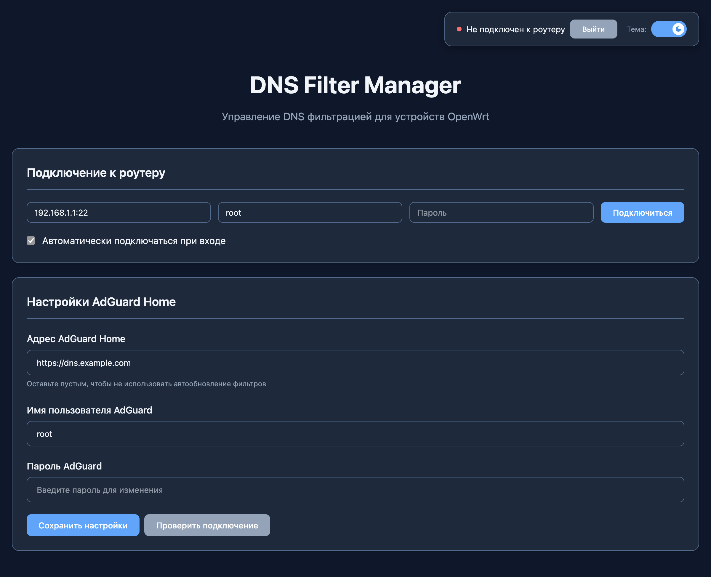
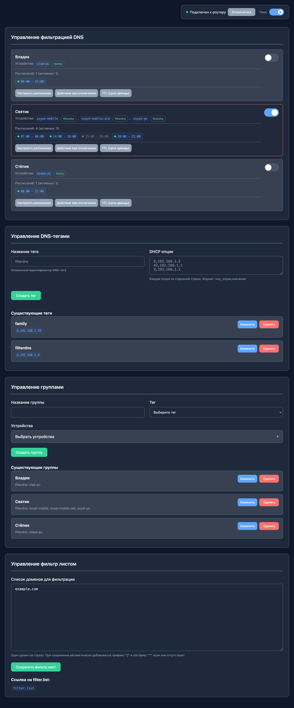

# DNS Filter Manager

DNS Filter Manager — это мощный веб-инструмент для гибкого управления политиками сетевой фильтрации на основе групп устройств. Он разработан для тесной интеграции с роутерами на **OpenWrt** и DNS-фильтрами, такими как **AdGuard Home**, позволяя динамически назначать различные правила фильтрации для разных устройств в вашей сети.

## Принцип работы

Основная идея проекта — предоставить удобный интерфейс для управления тем, какой DNS-сервер используется конкретной группой устройств в вашей сети.

1. **Интеграция с OpenWrt:** Приложение подключается к вашему роутеру по SSH и считывает список активных DHCP-клиентов (устройств).
2. **Группы и Теги:** Вы создаете **группы** (например, «Детские устройства», «Рабочие ноутбуки», «IoT-гаджеты») и **теги**.
3. **Теги как Политики:** **Тег** — это набор правил DHCP. Чаще всего он используется для назначения группе определенного DNS-сервера, например, вашего экземпляра **AdGuard Home**. В AdGuard Home можно создать разные профили клиентов с уникальными наборами правил блокировки (например, блокировка взрослого контента для детей), а затем назначить их нужной группе через тег в DNS Filter Manager.
4. **Гибкость DHCP:** Теги могут задавать не только DNS, но и другие DHCP-опции, а также управлять временем жизни DHCP-аренды (TTL). Это позволяет реализовывать более сложные сценарии, например, направлять трафик группы устройств через отдельный фильтрующий шлюз или ускорять применение политик.

Таким образом, DNS Filter Manager выступает в роли центрального пульта управления, который применяет политики (теги) к группам устройств, изменяя их сетевые настройки на лету.

## Основные возможности

* **Управление группами и тегами:** Создавайте группы устройств и назначайте им теги с предопределенными политиками фильтрации.
* **Двусторонняя синхронизация с OpenWrt:** Автоматическое обнаружение устройств, а также импорт существующих на роутере тегов и настроек DHCP Leasetime для быстрой начальной настройки и предотвращения рассинхронизации конфигурации.
* **Интеграция с AdGuard Home:**
    * Назначайте разные DNS-настройки AdGuard Home (через "Клиенты") разным группам устройств.
    * Создавайте и редактируйте собственные списки блокировки доменов, которые мгновенно синхронизируются с AdGuard Home.
* **Планировщик и ручное управление:** Включайте и отключайте фильтрацию для групп по расписанию (например, доступ к игровым сайтам только по вечерам) или вручную одним кликом.
* **Гибкие групповые политики:**
    * Настраивайте **действие при отключении фильтрации**: полное снятие тега (устройство без фильтрации) или переключение на другой, "базовый" тег.
    * Устанавливайте **индивидуальный срок аренды DHCP (Leasetime/TTL)** для каждой группы. Чем меньше значение, тем быстрее устройства получат новые настройки при смене политик.
* **Продвинутые DHCP-опции:** Теги могут управлять не только DNS, но и другими параметрами DHCP, что открывает простор для кастомных сетевых конфигураций.
* **Удобное управление устройствами:** Быстрое удаление устройства сразу из всех групп, в которых оно состоит, что упрощает администрирование при большом количестве устройств.

<p align="center">
 
</p>
<p align="center">
 
</p>

## Установка и запуск с помощью Docker

Для быстрого старта и простоты развертывания рекомендуется использовать Docker.

### Шаг 1: Получение SSL-сертификата (рекомендуется)

Для безопасного доступа по HTTPS мы будем использовать `acme.sh` для выпуска SSL-сертификата от Let's Encrypt.

> **Примечание:** Убедитесь, что доменное имя (в примере `dfm.example.com`) направлено на IP-адрес вашего сервера, и порт `80` свободен.

```bash
docker run --rm -it \
-v /data/acme:/acme.sh \
-p 81:80 \
neilpang/acme.sh \
--issue --standalone -d dfm.example.com --email email@example.com -k 2048
```

* Замените `dfm.example.com` на ваше доменное имя.
* Замените `email@example.com` на ваш адрес электронной почты.


### Шаг 2: Подготовка директорий и прав доступа

Создайте папки для конфигураций и списков, а затем установите для них правильные права доступа (UID/GID `1000`).

```bash
mkdir -p /data/dns-filter-manager/{conf,lists}
chown -R 1000:1000 /data/dns-filter-manager
chown -R 1000:1000 /data/acme/dfm.example.com
```


### Шаг 3: Запуск контейнера DNS Filter Manager

Теперь можно запустить основной контейнер приложения.

```bash
docker run -d \
--name dns-filter-manager \
--restart=unless-stopped \
-e PORT=443 \
-e USE_HTTPS=1 \
-e HTTPS_CERT_FILE=/acme/fullchain.cer \
-e HTTPS_KEY_FILE=/acme/dfm.example.com.key \
-e ENCRYPTION_KEY=your-very-secret-key \
-e SESSION_SECRET_KEY=your-very-secret-key \
-v /data/acme/dfm.example.com:/acme:ro \
-v /data/dns-filter-manager/conf:/app/conf \
-v /data/dns-filter-manager/lists:/app/lists \
-p 443:443 \
zerolabnet/dns-filter-manager:latest
```

**Важно:**

* Обязательно замените `your-very-secret-key` на ваши собственные `ENCRYPTION_KEY` и `SESSION_SECRET_KEY`. Это критически важно для безопасности. Вы можете сгенерировать их или получить из логов контейнера при первом его запуске без указания этих переменных.
* Убедитесь, что путь в `-v /data/acme/dfm.example.com:/acme:ro` соответствует домену из Шага 1.

После выполнения этой команды приложение будет доступно по адресу `https://dfm.example.com`. Для входа используйте пароль, который генерируется и отображается в журнале контейнера при первом запуске.

## Конфигурация

Приложение настраивается с помощью переменных окружения при запуске Docker-контейнера.


| Переменная | Описание | Значение по умолчанию |
| :-- | :-- | :-- |
| `PORT` | Порт, на котором приложение будет работать внутри контейнера. | `8080` |
| `USE_HTTPS` | Включает режим HTTPS. Установите в `1`, чтобы активировать. | `0` |
| `HTTPS_CERT_FILE` | Путь к файлу SSL-сертификата внутри контейнера. |  |
| `HTTPS_KEY_FILE` | Путь к файлу приватного ключа SSL внутри контейнера. |  |
| `ENCRYPTION_KEY` | Секретный ключ для шифрования чувствительных данных (пароли SSH, AdGuard). **Обязательно измените!** | (генерируется) |
| `SESSION_SECRET_KEY` | Секретный ключ для подписи сессионных cookie. **Обязательно измените!** | (генерируется) |
